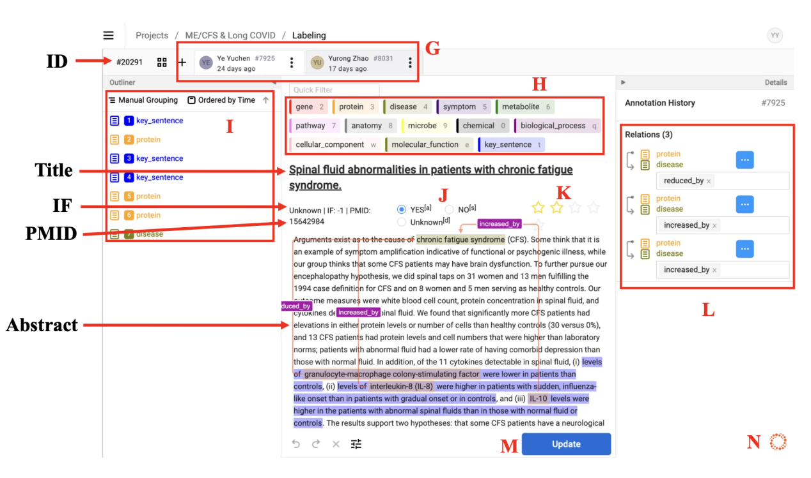

# Knowledge Curation Tutorial

Taking Long COVID & ME/CFS as an example

"A Guide to Knowledge Mining for Collaborative Development —— Using the Prophet Label Studio website, using Long COVID & ME/CFS as an example"

If you have any questions, please contact the administrator. We are working on the improvement of the label studio and curation process. We will update the tutorial in time. Thank you for your support and understanding. Also, we are looking forward to your feedback.

## Log in

Log in into the Prophet Label Studio from the web link https://prophet-studio.3steps.cn/user/login/. Asking administrator to have an account, password and organization to log in. Or you can follow the step in our homepage. 

 

## Components

### Main Interface

After you enter the website, you can see the content as follows. The details are as follows.

 

### Project Management

All projects under your organization will be presented here.You can further choose the project to label.

 

### Knowledge Graph Editor

Knowledge Graph is a website/tool used to visualize your annotation results by means of a knowledge graph. Everything you have marked will be displayed here. The final visualization will be shown here. We don't use this editor here, so we won't expand on the description.***\*Switching between these three interfaces can be accomplished by selecting the top tabs.\****

 

 

 

### Knowledge Graph Editor - Mapping Tool

As you can see, knowledge graph editor is a bridge between Label Studio and Knowledge Graph, which can also be referred to as the annotated content and its visualization results. Its functionality must be enabled only when there is already labeled content, otherwise it will display no task id found. The details will be shown in the subsequent tutorial.

 

After pressing the area indicated by the letter B, you may enter the secondary working interface. The details are as follows.

 

 

### Curator Tab

Each tag represents an author, and filters can be used underneath the author tag to assign the content to be labeled by that author. **One can add curators via the plus button after the tags**.

 

## Labeling

### Labeling Interface

After selecting the specific article, you may enter the main working interface. The details are as follows.

 

Each author's annotations on this article will be displayed below the respective author's tag, you can view other people's annotations but can't modify or delete them. If you want to add new annotations then you can press the plus sign, if you want to delete your own annotations you can press the three dots.

 

### Colorful Entity Label

Each entity category has a different color to differentiate and mark it, so be careful not to make mistakes or confuse it. Details can be seen in another document. If you expect to add new entity categories, please contact the administrator.

 

 
### Annotation

This area shows content that has been marked up by the author and can be categorized by time or entity category.

 

### Judgement

You can determine whether this article is relevant to your research topic by selecting Yes, No or Unknown.

 

### Scoring

The five stars are a scoring system that scores the literature and knowledge against criteria set by you individually or as a team, with one star being the lowest and five stars being the highest.

 

### Relations

There should be at least one connection between the labeled entity and the entity. If you expect to add new relation types, please contact the administrator. Currently, we have not standardized the relation types, so you can add any relation types you want. We will collect the feedback and standardize the relation types in the future.

 

### Submit & Update

To save the annotation, you can click the Submit or Update button. Please save your progress often and save or update your document after you have completed the knowledge curation of a piece of literature, as this may save you from losing the current progress of your work.

 

### Knowledge Graph Editor - Mapping Findings with Knowledge Graph

The mapping tool is used to map the labeled content to the knowledge graph. You need to select the labeled content and the corresponding knowledge graph node to map them. When you open the component, it will sync all relations you labeled into the table. You can click the "Edit" button to finish the mapping for each relation. You can search standardized source id and target id with source name and target name. After picking up the source id, target id and key sentence, you can click the "Update" button to update the mapping. If you want to delete the mapping, you can click the "Delete" button.

NOTE: Currently, the knowledge graph don't support Protein entity, so you can change the source type and target type to "Gene" first and then search the source id and target id.

 

More details about the mapping tool can be found in the [Knowledge Graph Editor Tutorial](./kge.md).

### Full Text Needed

Yes and No to indicate whether the full text is needed to further explore the knowledge. NOTE: Currently, we don't support the full text labeling, but we need to know whether the full text is needed.

 

### Note

The "Content" box at the bottom allows you to write down your notes or ideas.
 
 

## Notice

More details about the notice can be found in the [Notice](./notice.md).