## Step 1

Once you have labeled the entities and made the connections between them, you are ready to start editing the knowledge graph (Figure 1). Please remember to save and update before you match the knowledge.

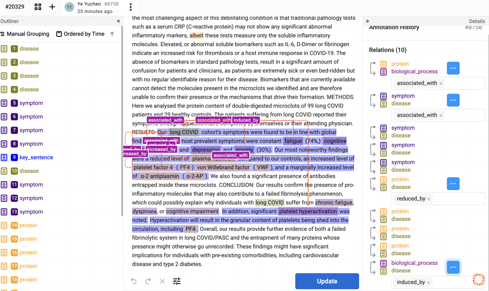

## Step 2

Press the circle-shaped chart in the lower right corner (Figure 2). And then you'll be taken to the Knowledge Graph Editor screen, the details are as follows (Figure 3).

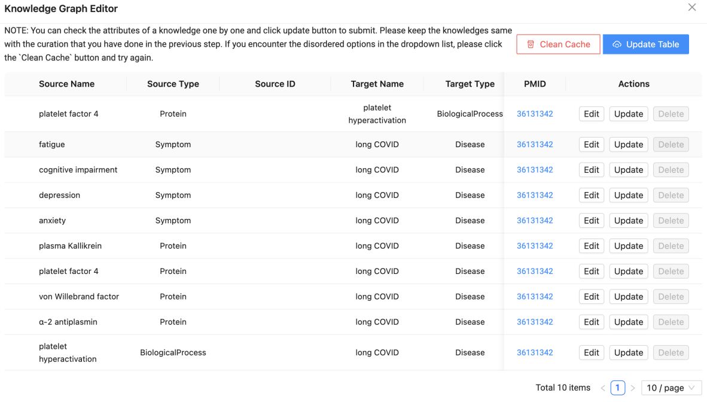

## Step 3

Now you are ready to start matching entities and their relationships in the editor. As shown in the figure, Source Type, Source ID, Target ID, Relation Type, and Key Sentences are available for selection (Figure 4a, 4b, 4c). To see more information about an option, you can hover the mouse cursor over the option to view it (Figure 4c).

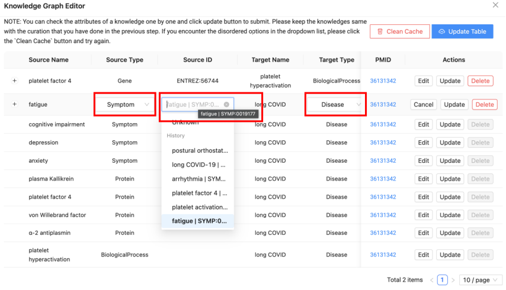

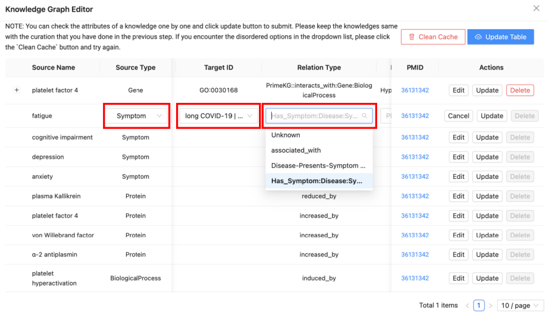

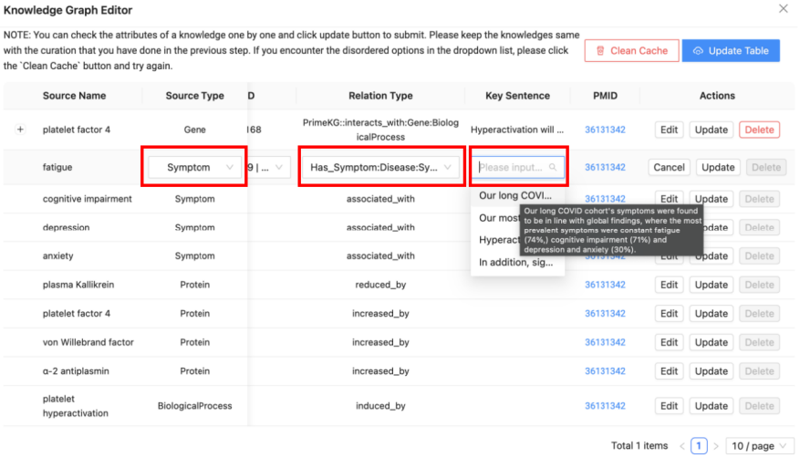

## Step 4

While we generally make changes to Source ID, Target ID, Relation Type, and Key Sentences, and generally leave the Source Type unchanged, except for the Protein category. Because in the Knowledge Graph Editor, we need to align Protein entities to Gene entities (Figure 5), details can be found in the Knowledge Mining Guidelines for Collaborative Development.

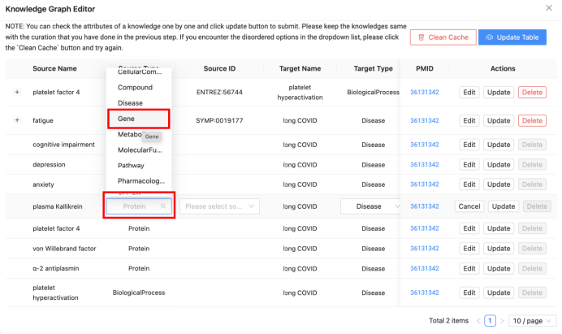

- A. Source ID: Source ID needs to be the same as Source Name. The databases to be selected for each entity class table can be found in the Collaboration document (Figure 6a).

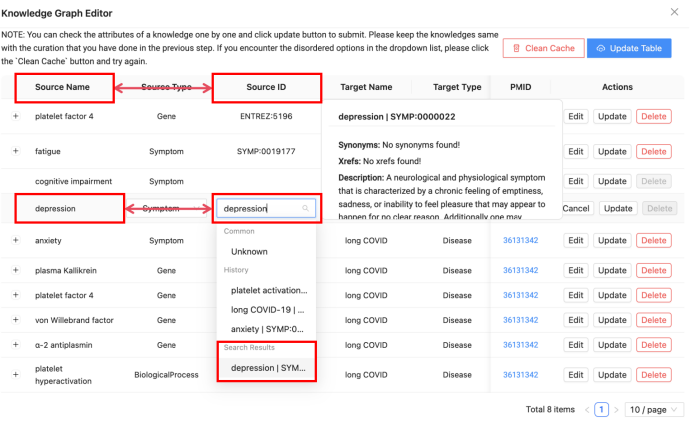

- B. Target ID: Source ID needs to be the same as Source Name. The databases to be selected for each entity class table can be found in the Collaboration document (Figure 6b).

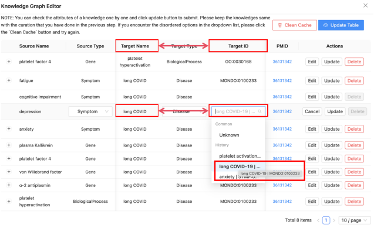

- C. Relation Type: Relation Type should be based on the associative editing mentioned within the literature, details can be viewed in the Collaboration document (Figure 6c).

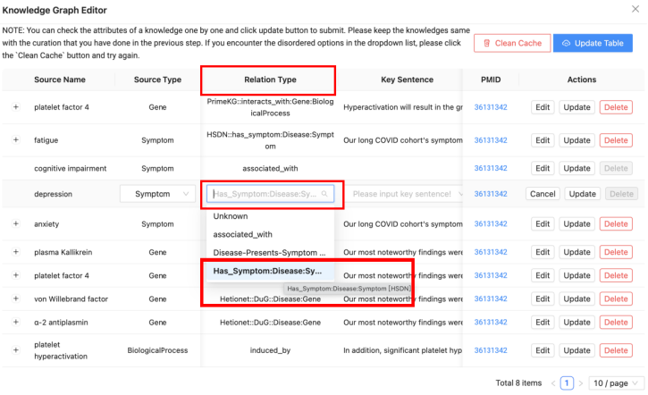

- D. Key Sentence: Key phrases are generated from what is labeled on the Prophet Label Studio, and there can be multiple key phrases to choose from (Figure 6d).

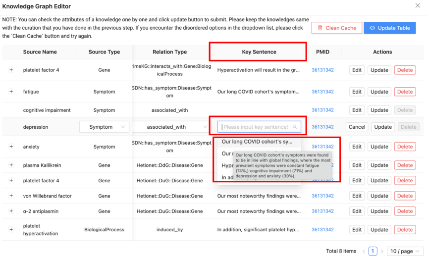

- E. Unknown: If there is an entity that is not in the editor or you are not sure about it, you can edit it as Unknown and wait for further refinement (Figure 6e).

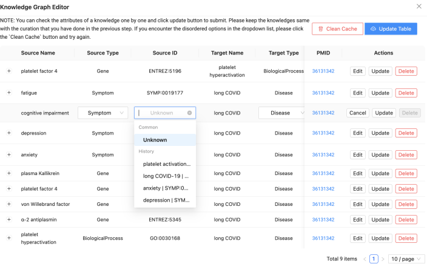

## Step 5

After editing, if you want to save/update, you can press the Update button. If you made a mistake in editing or don't need the content of the entry, you can press the Delete button. And if you want to re-edit, you can press the Edit button (Figure 7).

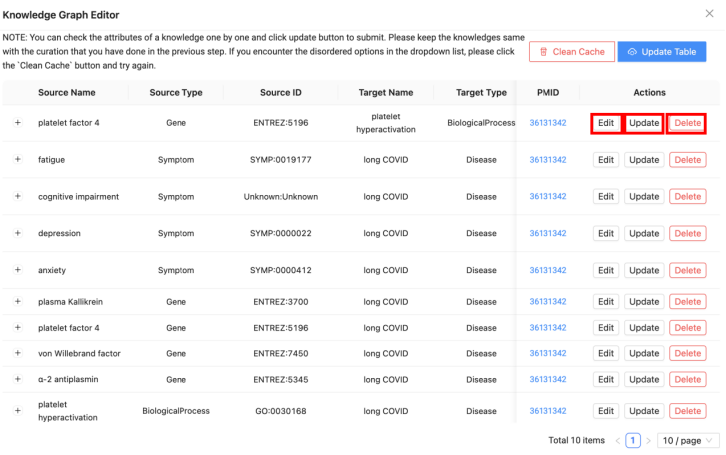

## Step 6

When you start marking and end marking, you may need to use the two buttons in the upper right corner (Figure 8). The details are as follows.

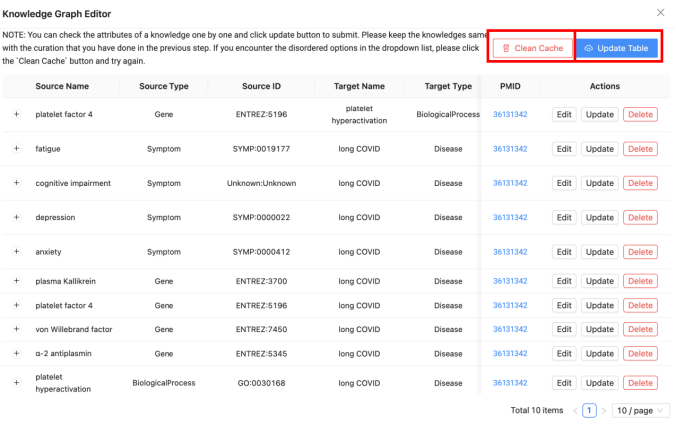

- F. Clean Cache: In order to reduce duplicate searching, the search function will display the search history. If the search history is too long to affect the search, you can press Clean Cache to clear the history cache (Figure 9).

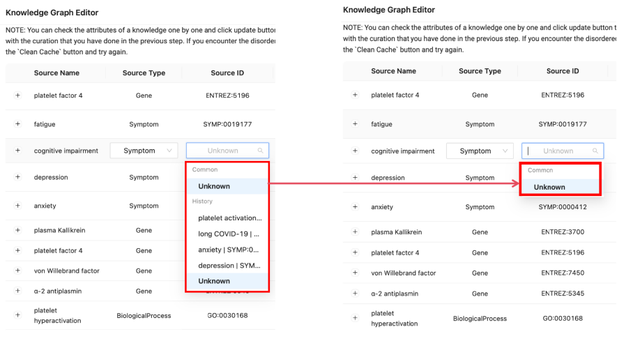

- G. Update Table: If you need to match the knowledge of another article, at this point you can click on the Update Table button to successfully convert the article in the editor (Figure 10).

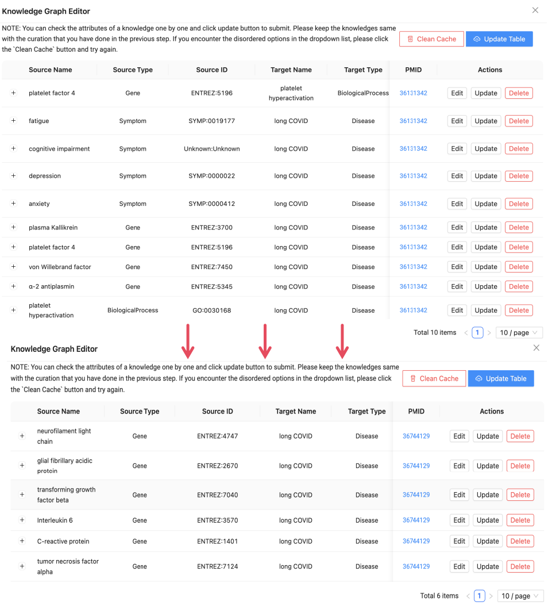