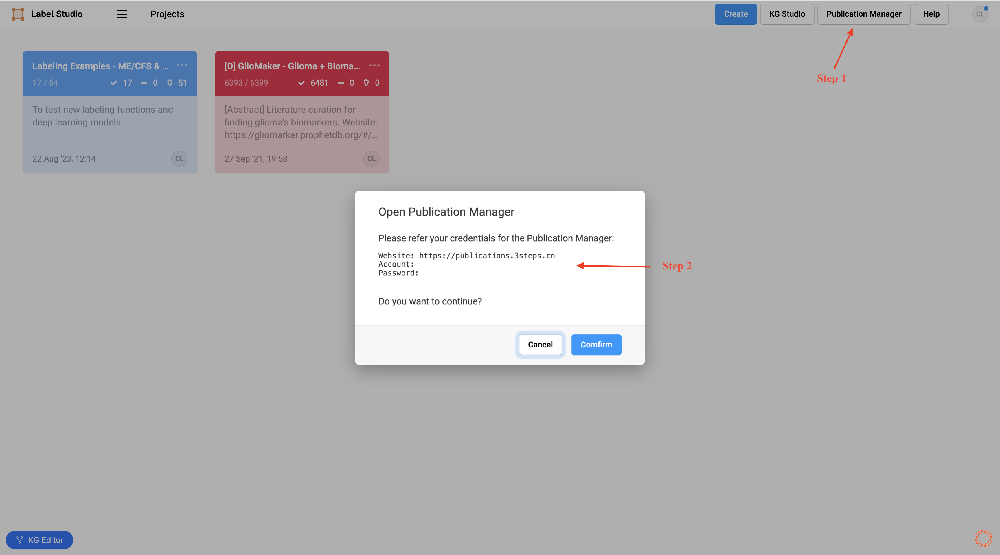
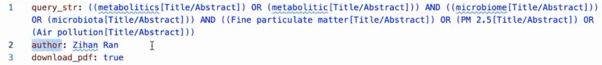
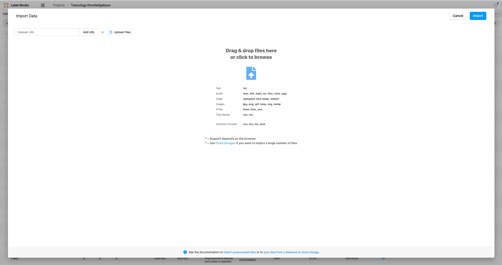
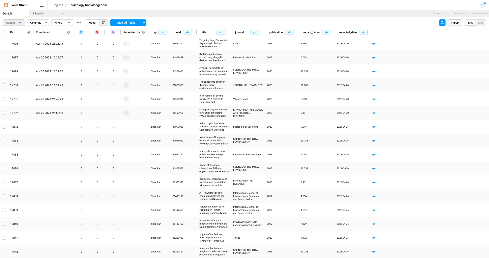

## 登陆Publication Manager系统

按图中说明操作，登陆Publication Manager系统



## 准备 & 上传待标注文献

> 注意事项：
> 1. **建议采取少量多次上传文献并标注的方法；**少量多次上传具有以下优势：① 可节省单次导入时间，提升系统获取论文的成功率；② 有助于建立正向反馈；③ 可避免标注任务堆积到特定Tab页下，并影响其他人锁定感兴趣的论文。
> 2. **无需担心文献重复标注问题；**系统将自动过滤掉重复的文献。每次上传配置文件，系统将在`metadata/<项目名>`目录下生成与配置文件名为前缀的两个文件。如：`20230425-ToxicologyKnowledgebase.json`和`20230425-ToxicologyKnowledgebase_duplicated.json`（当存在重复文献时生成）；
> 3. **同一篇文献在系统中只会出现一次；**若发现检索式搜索到的文献与实际上传文献数目不同，可能是因为部分文献已被其他人导入至系统，并将由其完成标注；若需确认，有两种方式：① 在`Default`标签页下使用`Filter`功能筛选关注的文献，查看是否已存在于系统中并由谁上传（Tag字段）。使用完后请及时清除`Filter`选项，避免影响其他人；② 联系系统管理员查看后台日志；
> 4. **支持删除部分异常论文并重新导入；**若部分论文摘要等信息出现异常，需要重新上传这部分论文时，可参照以下流程实现：① 按如下文档制作基于pmid的检索式；② 联系系统管理员从`Prophet Label Studio`中删除拟重新上传的论文记录；③ 将对应的`*_duplicated.json`文件上传至`Prophet Label Studio`；

1. 依据项目需求确定一个可用于查询指定pubmed文献的检索式，以获取你想要标注的论文。
   
   - 示例一（基于关键词检索）

    ```
    ((metabolitics[Title/Abstract]) OR (metabolitic[Title/Abstract])) AND ((microbiome[Title/Abstract])) OR (microbiota[Title/Abstract])) AND ((Fine particulate matter[Title/Abstract]) OR (PM 2.5[Title/Abstract]) OR (Air pollution[Title/Abstract]))
    ```

   - 示例二（基于一组PMIDs检索）
  
    ```
    27261907 OR 27535388 OR 29635240
    ```

   - 示例三

    直接上传从Endnote、Papers等软件导出的bib格式文件。请在导出之前确保已更新每篇文献的metadata，当前流程依赖于bib文件中的Pubmed ID，缺少ID的文献将被忽略。<br />**若上传bib文件，则跳过步骤2。**

2. [可选] 准备一个yaml文件，其中包含两个字段：query_str和download_pdf。你需要使用纯文本编辑器或代码编辑器来创建这个yaml文件。建议文件名为`<年月日>-<项目名>.yaml`，如`20230425-ToxicologyKnowledgebase.yaml`。**该yaml文件必须有以下字段（均无需引号）： **
   
    ```
    query_str: <你的查询字符串>
    download_pdf: true
    ```
    
    例如：<br />

    > 注意：
    > 1. query_str字段用于查询pubmed中你想要标记的论文。
    > 2. download_pdf字段是可选的。其用于指示流程是否应该自动下载论文的pdf文件。如果你把它设置为true，流程将自动下载论文的pdf文件。如果设置为false，流程将不会自动下载论文的pdf文件。你可以通过paper-downloader工具手动下载pdf文件。下载完所有论文的pdf文件后，你需要重新导入元数据文件到Label Studio。元数据文件将被存储在metadata/<人名>文件夹中。pdf文件将存储在pdf文件夹中。[注意：不是所有的论文都有pdf文件，如果你在Label Studio看到一篇没有pdf文件的论文，这意味着流程无法自动下载该论文的pdf文件。你可以手动下载pdf文件，并将其上传到pdf文件夹中] 。

3. 要把yaml/bib文件上传到`config/<人名>`文件夹中 。上传后钉钉群组将收到相应通知“收到新的检索式，正在处理中，请稍后。”  例如：[All Buckets/publications/config/ZihanRan] 

4. 等待几分钟，让流程获取论文并生成论文的元数据文件。元数据文件将存储在`metadata/<人名>`文件夹中。如果你想检查流水线的进度，你可以查看钉钉群组。但如果你启用download_pdf字段，流程将需要较长时间来下载论文的pdf文件。你可以通过检查`pdf/<project_name>`文件夹来检查流程的进度。该流程将逐一下载论文的pdf文件。如果你在`pdf/<project_name>`文件夹中看到相应的pdf文件，这意味着流程已经完成了论文的pdf文件的下载。[注意：不是所有的论文都有pdf文件，如果你在Label Studio看到一篇没有pdf文件的论文，这意味着流程无法下载该论文的pdf文件。
   
5. 系统在完成上述流程的过程中，可能出现如下类型的通知：
   
   - “Zihan Ran上传了新的检索式，系统已获取到新的文献元数据。正在下载文献PDF，请稍后。”：流程已经完成了对论文元数据的获取
   - “系统已下载完所有文献PDF。请前往Prophet Studio查看。”：流程已完成PDF文件的下载
   - “系统已处理完毕Zihan Ran上传的新的检索式。请前往publications.3steps.cn下载Metadata，并导入至Prophet Studio。”：已完成所有流程

6. 在收到如5c所示的通知后，可登录[publications.3steps.cn](https://publications.3steps.cn)。找到并下载对应的`metadata/<人名>/<年月日>-<project_name>.json`文件。并将下载到的元数据文件上传到Prophet Label Studio。
   
7. 上传步骤如下图所示：① 进入对应项目后，点击右上角的`Import`按钮；② 出现文件上传页面后，点击`Upload Files`选择拟上传的JSON文件；③ 在文件上传页面点击右上角的`Import`按钮即可完成上传。





8. 进入个人Tab页，核对已经上传的新文献是否出现在了自己的Tab标签页下。若未出现则需考虑是否正确上传了config文件至特定人名目录。**若上传错误，请务必联系管理员删除本次上传的数据，并重新完成上述流程。**

## 文献标注示例与标注方法
待上传视频教程


## 正确示例 vs. 常见错误示例
待补充
